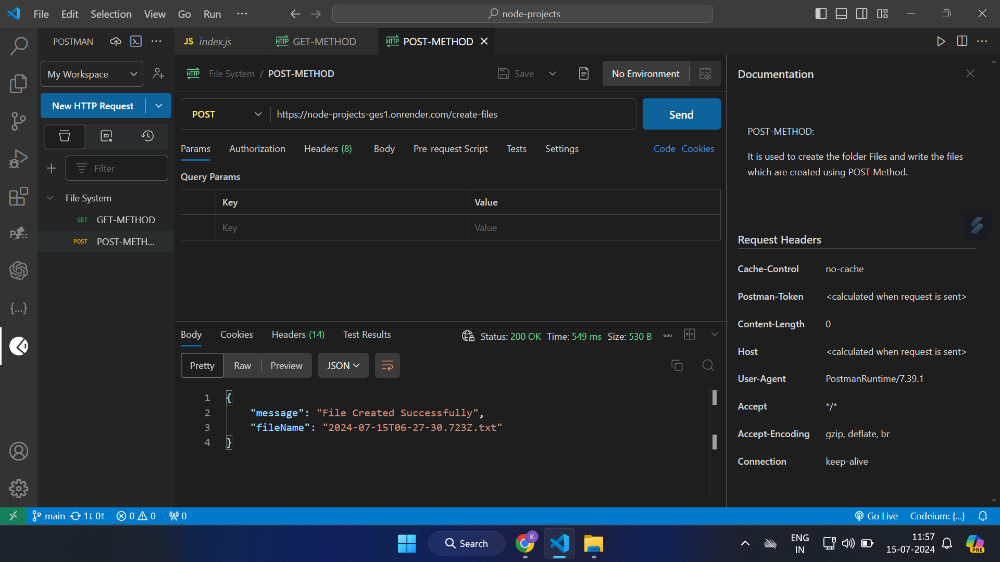
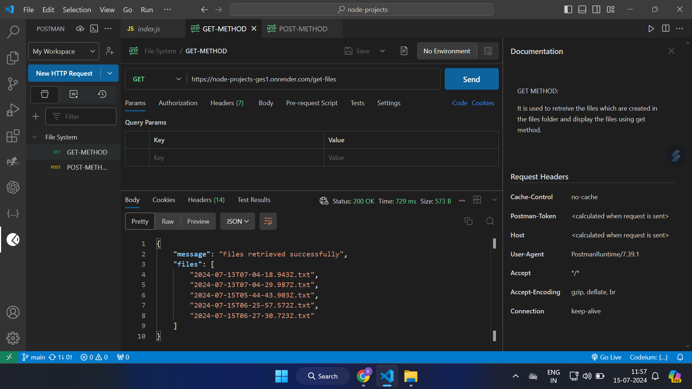

TASK DETAIL :

Write API Endpoint which will create text file in particular folder.

Content of the file should be current timestamp Filename should be current date-time.txt

Write API Endpoint to retrive all the files in particular folder.

RENDER URL --> https://node-projects-ges1.onrender.com

END POINTS :

GET METHOD - /get-files --> To collect all existing files from public folder. 
POST METHOD - /create-files --> To create new file at public folder.

 
